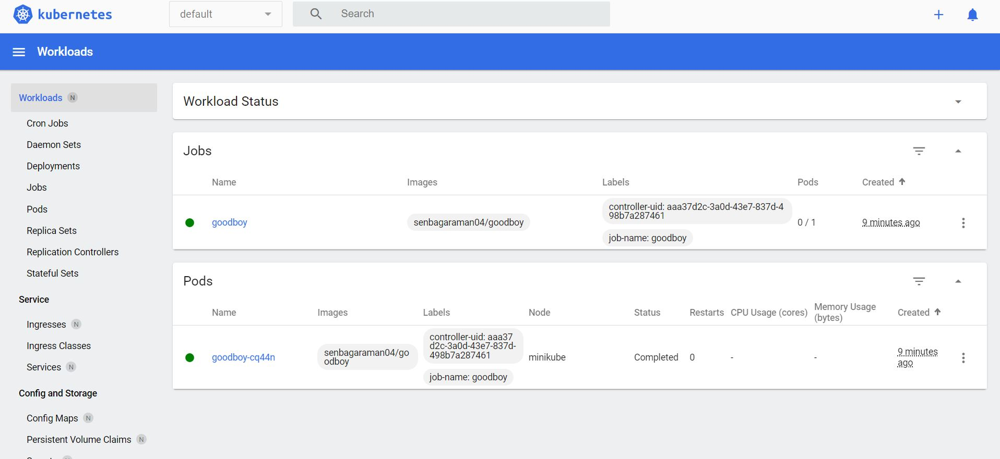

## Steps

1. Create a Docker File. Update the contents of the file,

```

FROM busybox
CMD ["echo", "Senbagaraman is a good Boy"]

```

2. Run the following command in the terminal to create the image out of the content created.

```
docker build . -t senbagaraman04/good-boy
```

3. Run the following command to run the image 

```
docker run senbagaraman04/good-boy
```

4. Create yml configuration file to run this container as a Kubernetes job

5. Create job out of the yml file.

6. Run the following commands

```
kubectl create -f goodboy.yml  # create the cluster from this docker image
minikube docker-env # get all the docker env variables
eval $(minikube -p minikube docker-env)  # Pass the values of the docker env. values to the system, so it can be pulled from the cluster.
```

7. Now delete the cluster and run it again

```
docker build . -t senbagaraman04/goodboy
kubectl delete -f goodboy.yml
kubectl create -f goodboy.yml
```

8. Run the command to get all the kube pods.

```
kubectl get pods
```


## Mini Kube Dashboard

run the following command to run the minikube 

```
minikube start
minikube dashboard
```

The running image will be visible in the dashboard



